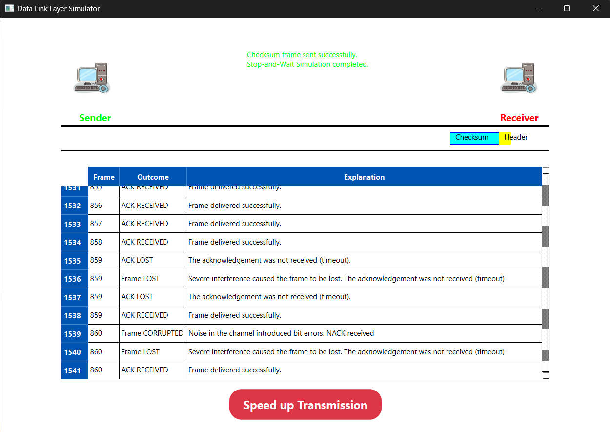

# Data Link Layer Simulator

## Açıklama
- 2024-2025 Bahar Veri İletişimi ve Bilgisayar Ağları dersi ödevi olarak yapılmıştır.

## Katkıda Bulunanlar
- [Ahmet Mahir Demirelli](https://github.com/Ahmet-MahirDEMIRELLI)
- [Koço Fani](https://github.com/kocofani23)
- [Toghrul Mirzazade](https://github.com/Togster01)
- [Berkay Çimşir](https://github.com/berkaycimsir)

## Kullanılan Teknolojiler
- QtCreater
- C++

## Ekran Görüntüleri

##
- Not: 75
